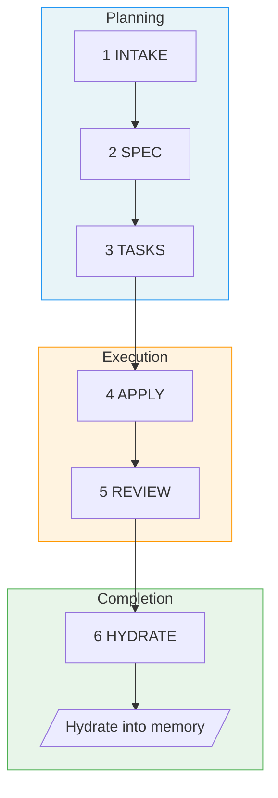

# Fab Kit

A Specification-Driven Development (SDD) workflow that runs entirely as AI agent prompts — no CLI, no system dependencies. Copy it into your project and go.

## Why Fab Kit?

- **Resumable by design** — Every stage produces a persistent artifact. Walk away mid-change, come back tomorrow, and pick up exactly where you left off.
- **Stages that don't get skipped** — Intake, spec, tasks, apply, review, hydrate. The pipeline encodes the discipline so the agent (and you) can't quietly skip straight to code.
- **Fast-forward when confidence is high** — `/fab-ff` and `/fab-fff` let you blast through multiple stages when the change is well-understood, without sacrificing structure when it isn't.
- **Deterministic progress tracking** — `.status.yaml` and stage checklists give you a single source of truth for where a change stands.

## Prerequisites

Install the following with [Homebrew](https://brew.sh/) (works on macOS and Linux):

```bash
brew install yq gh bats-core direnv
```

| Tool | Purpose |
|------|---------|
| [yq](https://github.com/mikefarah/yq) | YAML processing for status files and schemas |
| [gh](https://cli.github.com/) | GitHub CLI — used for installation and releases |
| [bats-core](https://github.com/bats-core/bats-core) | Bash test runner for kit validation |
| [direnv](https://direnv.net/) | Auto-loads `.envrc` to put fab scripts on PATH |

After installing `gh`, authenticate with `gh auth login`.

## Quick Start

### 1. Install

**From GitHub releases** (requires [gh CLI](https://cli.github.com/) with authentication):

```bash
mkdir -p fab
gh release download --repo wvrdz/fab-kit --pattern 'kit.tar.gz' --output - | tar xz -C fab/
```

Or from a local clone:

```bash
cp -r /path/to/fab-kit/fab/.kit ./fab/
```

### 2. Initialize

```bash
fab/.kit/scripts/fab-sync.sh            # creates directories, symlinks, .gitignore
direnv allow                            # approve .envrc (adds scripts to PATH)
```

Then open your AI agent and run:

```
/fab-setup    # Claude Code
$fab-setup    # Codex
```

### 3. Your first change

```
/fab-new Add a loading spinner to the submit button      # or $fab-new in Codex
```

Here's what happens:

1. The agent creates an `intake.md` capturing intent and scope, asking you clarifying questions
2. Run `/fab-continue` (`$fab-continue`) — generates a `spec.md` with requirements
3. Run `/fab-continue` — generates a `tasks.md` with an implementation checklist
4. Run `/fab-continue` — the agent implements the code, checking off tasks as it goes
5. Run `/fab-continue` — reviews the implementation against the spec
6. Run `/fab-continue` — hydrates learnings into project memory, then archive

At any point, run `/fab-status` (`$fab-status`) to see where you are.

For small, well-understood changes, `/fab-ff` (`$fab-ff`) fast-forwards through all planning stages at once, and `/fab-fff` (`$fab-fff`) runs the entire pipeline autonomously.

## The 6 Stages



| # | Stage | Purpose | Artifact |
|---|-------|---------|----------|
| 1 | **Intake** | Capture intent, scope, approach | `intake.md` |
| 2 | **Spec** | Define requirements | `spec.md` |
| 3 | **Tasks** | Break into implementation checklist | `tasks.md` + `checklist.md` |
| 4 | **Apply** | Execute the tasks | Code changes |
| 5 | **Review** | Validate against spec | Validation report |
| 6 | **Hydrate** | Complete and hydrate into memory | Memory updates |

## Command Quick Reference

> **Prefix:** Use `/fab-*` in Claude Code, `$fab-*` in Codex.

| Command | Purpose |
|---------|---------|
| `/fab-setup` | Bootstrap fab/ structure, manage config/constitution, apply migrations |
| `/fab-new <description>` | Start a new change |
| `/fab-continue` | Advance to next stage |
| `/fab-ff` | Fast-forward all planning stages |
| `/fab-fff` | Full autonomous pipeline (requires confidence >= 3.0) |
| `/fab-clarify` | Deepen current artifact before moving on |
| `/fab-status` | Check current progress |
| `/fab-switch` | Switch active change |
| `/fab-archive` | Archive a completed change |
| `/docs-hydrate-memory [sources...]` | Ingest external docs into memory |

## What's in the Box

```
fab/.kit/
├── VERSION          # Semver version string
├── skills/          # Markdown skill definitions for AI agents
├── templates/       # Artifact templates (intake, spec, tasks, checklist)
├── scripts/         # Shell utilities (setup, upgrade, release)
└── schemas/         # Workflow schema and validation
```

The kit provides the 6-stage workflow above. See [docs/specs/index.md](docs/specs/index.md) for the full specification.

## Updating

```bash
fab-upgrade.sh       # downloads latest kit, replaces fab/.kit/, repairs symlinks
```

If the upgrade reports a version mismatch, run `/fab-setup migrations` in your AI agent to apply migrations. Safe to re-run.

To repair symlinks and scaffold structure without downloading a new release (useful when developing fab-kit itself):

```bash
bash fab/.kit/scripts/fab-sync.sh
```

## Learn More

- **[Design & Workflow Details](docs/specs/overview.md)** — principles, detailed stage descriptions, example workflows
- **[User Flow Diagrams](docs/specs/user-flow.md)** — visual maps of the full pipeline, shortcuts, rework paths, and state machine
- **[Full Command Reference](docs/specs/skills.md)** — detailed behavior for every `/fab-*` skill
- **[Glossary](docs/specs/glossary.md)** — all Fab terminology defined
- **[Contributing](CONTRIBUTING.md)** — developing, extending, and releasing Fab Kit
