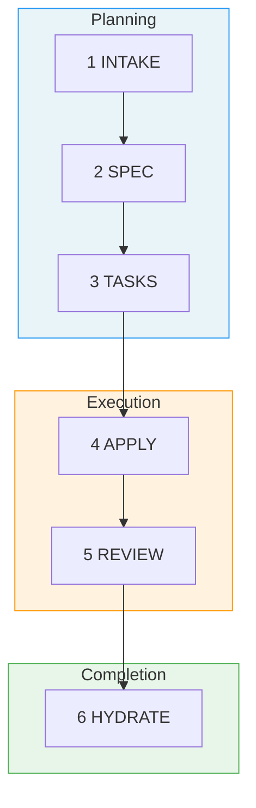

# Fab Kit

A structured development workflow for AI agents. You describe a change, AI plans it, implements it, reviews it, and saves what it learned into shared project memory. Each completed change builds shared context, so future changes start with better knowledge.

AI agents are getting better at writing code fast. The bottleneck is shifting to you: did you define the problem well enough? Fab Kit sits at that bottleneck - it forces structured thinking before implementation, gives you a legible signal of your own clarity, and grounds every session in your project's actual context.

Fab Kit is a 6-stage pipeline defined entirely in markdown prompts - no SDK, no vendor lock-in. The skills are plain prompts any AI agent can execute (Claude Code, Codex, Cursor, Windsurf). Copy it into your project and go. It's plain markdown and shell, so it gets cheaper to run as agents improve, not more expensive.

The more capable AI agents become, the wider the gap between what they can build and what humans can clearly articulate. Fab Kit sits in that gap - and it grows with it.

> **[Try it now](#quick-start)** | **[Understand the concepts](#why-fab-kit)**

**Contents:** [The 6 Stages](#the-6-stages) · [Prerequisites](#prerequisites) · [Quick Start](#quick-start) · [Why Fab Kit](#why-fab-kit) · [Commands](#command-quick-reference) · [Learn More](#learn-more)

## The 6 Stages

Every change (a self-contained feature or fix with its own folder) moves through six stages:



| # | Stage | Purpose | Artifact |
|---|-------|---------|----------|
| 1 | **Intake** | Capture intent, scope, approach | `intake.md` |
| 2 | **Spec** | Define requirements | `spec.md` |
| 3 | **Tasks** | Break into implementation checklist | `tasks.md` + `checklist.md` |
| 4 | **Apply** | Execute the tasks | Code changes |
| 5 | **Review** | Sub-agent validates against spec and constitution | Prioritized findings report |
| 6 | **Hydrate** | Save learnings into project memory | Memory updates |

Each stage produces a persistent artifact. Interrupt anything - `/fab-continue` picks up from the last checkpoint.

Review is performed by a **sub-agent** running in a separate context - a fresh perspective that validates against both your spec and [project constitution](#code-quality-as-a-guardrail). Findings are prioritized (must-fix, should-fix, nice-to-have) and the agent triages them, looping back for automatic rework on the issues that matter most.

A change folder looks like this:

```
fab/changes/260101-abcd-add-spinner/
├── intake.md        # What you want and why
├── spec.md          # Requirements (generated)
├── tasks.md         # Implementation plan (generated)
├── checklist.md     # Progress tracking
└── .status.yaml     # Pipeline state (+ .fab-status.yaml at repo root tracks active change)
```

## Quick Start

### Prerequisites

#### Using Fab Kit

Install with [Homebrew](https://brew.sh/) (macOS and Linux):

```bash
brew install wvrdz/tap/fab-kit    # installs fab (shim), wt, idea
brew install yq jq gh direnv      # required tools
```

* After installing `gh`, authenticate with `gh auth login`.
* After installing `direnv`, add the hook [to your shell](https://direnv.net/docs/hook.html).

| Tool | Purpose |
|------|---------|
| [fab-kit](https://github.com/wvrdz/fab-kit) | Installs `fab` (version-aware shim), `wt` (worktree manager), `idea` (backlog manager) |
| [yq](https://github.com/mikefarah/yq) | YAML processing for status files and schemas |
| [jq](https://jqlang.github.io/jq/) | JSON processing for settings merge during sync |
| [gh](https://cli.github.com/) | GitHub CLI - used for releases and PR workflows |
| [direnv](https://direnv.net/) | Auto-loads `.envrc` to put fab scripts on PATH |

#### Developing Fab Kit

In addition to the above:

```bash
brew install go just
```

| Tool | Purpose |
|------|---------|
| [Go](https://go.dev/) | Required for building binaries from source (`src/go/`) |
| [just](https://github.com/casey/just) | Task runner for build, test, and release recipes |

### 1. Install

#### New project

```bash
fab init
```

The `fab` shim (installed via Homebrew above) handles everything: fetches the latest kit release, caches it locally at `~/.fab-kit/versions/`, runs setup, and creates `fab/project/config.yaml` with the pinned version.

**Then in your AI agent:**

```
/fab-setup    # Claude Code
$fab-setup    # Codex
```

This generates `fab/project/constitution.md` (your project's architectural rules) and completes the project configuration.

#### Alternative: curl install (without Homebrew)

```bash
curl -fsSL https://raw.githubusercontent.com/wvrdz/fab-kit/main/scripts/install.sh | bash
fab/.kit/scripts/fab-sync.sh
```

#### Updating from a previous version

To update the pinned version, edit `fab_version` in `fab/project/config.yaml` — the shim downloads the new version on next invocation. Or update the kit in-place:

```bash
fab-upgrade.sh           # downloads latest kit, replaces fab/.kit/, auto-runs fab-sync.sh
fab-upgrade.sh v0.24.0   # downloads a specific version instead of latest
```

If the upgrade reports a version mismatch, run `/fab-setup migrations` in your AI agent to apply migrations. Safe to re-run.

### 2. Your first change

```bash
# In your AI agent:

# Creation - creates change folder, writes intake.md, asks clarifying questions
/fab-new Add a loading spinner to the submit button

# Switch to the change (make it active via .fab-status.yaml)
/fab-switch
# Planning - generates spec.md (structured requirements)
/fab-continue
# Planning - generates tasks.md (implementation checklist)
/fab-continue
# Execution - implements the code, checking off tasks as it goes
/fab-continue
# Execution - reviews implementation against spec + constitution
/fab-continue
# Completion - saves learnings into docs/memory/
/fab-continue

# Completion - archives the change folder
/fab-archive
```

At any point, run `/fab-status` to see where you are.

For small changes, `/fab-ff` (fast-forward) skips intermediate planning stages - gated by a [confidence score](#structured-autonomy-not-guesswork) that ensures ambiguity is low enough for safe execution. Both `/fab-ff` and `/fab-fff` (full fast-forward) auto-loop between apply and sub-agent review, fixing issues automatically before escalating to you.

### 3. Going parallel

While AI works on one change, start another in a separate [git worktree](https://git-scm.com/docs/git-worktree) (an isolated copy of your repo):

```
/fab-new Add error toast for failed submissions
/fab-switch add-error-toast
```

Each change is a self-contained folder - multiple AI sessions run in parallel without conflicts. [How the assembly line works →](docs/specs/assembly-line.md)

### Troubleshooting

- `direnv allow` doesn't work - reload your shell or run `eval "$(direnv export zsh)"`
- `/fab-setup` not recognized - re-run `fab/.kit/scripts/fab-sync.sh` to repair symlinks

## Why Fab Kit

AI coding tools give you speed but leave you to manage quality and knowledge yourself. Fab Kit gives you all four:

| [**Speed**](#parallel-by-default) | [**Knowledge**](#shared-memory-that-grows-with-your-project) | [**Quality**](#code-quality-as-a-guardrail) | [**Autonomy**](#structured-autonomy-not-guesswork) |
|:---:|:---:|:---:|:---:|
| Parallel changes - never idle | Compounds with every change | Constitution + self-correcting review | SRAD-driven - assumes or asks based on context |

### Parallel by Default

<!-- Diagram: Traditional one-at-a-time workflow vs assembly line. In the traditional approach, you and AI alternate between working and idle. In the assembly line, you create batches of changes while AI executes previous batches - both stay busy. -->
```
  ██ = working    ░░ = idle

              One at a time
              ─────────────

  You    ██░░░░░░░░██░░░░░░░░██░░░░░░░░██░░░░░░░░
  AI     ░░████████░░████████░░████████░░████████

  Create, wait, review. Create, wait, review.
  More waiting than working.


              Assembly line
              ─────────────

  You    ██████░░█████████░██░█████████░██░░░░░░░
  AI     ░░░░░░██████████░████████████░░████████░

  Create a batch, hand off, create the next batch.
  Both always working.
```

Without Fab, you describe a task, wait while AI works, review, repeat. With Fab, you batch structured changes - each in its own folder and worktree - and create the next batch while AI executes the current one.

Three properties make this work:

- **Self-contained change folders** - Each change has its own spec, tasks, and status. No shared state - parallel changes don't interfere during development.
- **Git worktree isolation** - Each change runs in its own [worktree](https://git-scm.com/docs/git-worktree). Parallel AI sessions can't step on each other.
- **Resumable pipeline** - Every stage produces a persistent artifact. Interrupt anything, resume later.

### Shared Memory That Grows With Your Project

Most AI tools give each session a private memory that disappears when the session ends. Fab saves learnings from every completed change into `docs/memory/` - a domain-organized knowledge base committed to git and shared with the entire team.

```
  ┌──────────┐    hydrate     ┌──────────────┐
  │ spec.md  │ ─────────────▶ │ docs/memory/ │
  └──────────┘                └──────┬───────┘
       ▲                             │
       │       context for next      │
       └──────── change ─────────────┘
```

This creates a self-reinforcing cycle:

- **Every change makes the next one better** - Design decisions from `spec.md` merge into memory. Future changes load those files as context, so AI starts with real knowledge of your system instead of guessing.
- **Team knowledge, not personal notes** - Memory lives in git. Every developer and every AI session reads the same source of truth. Onboarding means cloning the repo.
- **Bootstrap from existing docs** - `/docs-hydrate-memory` ingests documentation from Notion, Linear, or local files. The pipeline keeps it current from there.
- **Structured, not append-only** - Memory is organized by domain (`auth/`, `payments/`, `users/`). `/docs-reorg-memory` restructures as it grows. `/docs-hydrate-specs` updates spec files with relevant details from memory.

### Code Quality as a Guardrail

AI writes code fast. Without structure, it also skips requirements, ignores architectural conventions, and ships the first thing that works. Fab enforces quality through structure, a constitution, and self-correcting review.

```
        ┌───────────────────────────────┐
        │  fab/project/constitution.md  │
        │    MUST · SHOULD · MUST NOT   │
        └───────────────┬───────────────┘
                        │
  intake → spec → tasks → apply ⇄ review → hydrate
             ↑       ↑       ↑    ↗
             └───────┴───────┴────┘
                sub-agent review
                with prioritized
                findings
```

- **Stages that can't be skipped** - The pipeline requires intake, spec, and tasks before any code is written. The AI can't jump straight to implementation. Before code is written, the [SRAD framework](#structured-autonomy-not-guesswork) ensures planning decisions are grounded in context - not silently guessed.
- **Project constitution** - `fab/project/constitution.md` defines your architectural rules using MUST/SHOULD/MUST NOT. Every spec, task breakdown, and review checks against it - not just the change's requirements.
- **Review that fixes, not just flags** - A **sub-agent** reviews in a fresh context, returning prioritized findings. The applying agent triages by severity and loops back to the right stage:

| Review finds | Priority | Loops back to | What happens |
|-------------|----------|---------------|--------------|
| Spec mismatch, failing tests | Must-fix | → apply | Unchecks failed tasks, re-runs them |
| Missing/wrong tasks | Must-fix | → tasks | Revises tasks, re-applies |
| Requirements were wrong | Must-fix | → spec | Updates spec, regenerates tasks |
| Code quality issue | Should-fix | → apply | Addressed when clear and low-effort |
| Style suggestion | Nice-to-have | - | May be skipped |

`/fab-fff` and `/fab-ff` auto-loop between apply and review (up to 3 cycles) - each re-review uses a fresh sub-agent. `/fab-ff` falls back to interactive rework after exhausting auto-retries.

#### The 5 Cs of Quality

Five configuration files shape how AI works in your project. Each answers a different question:

| C | File | Question |
|---|------|----------|
| **Constitution** | `fab/project/constitution.md` | What are our non-negotiable principles? |
| **Context** | `fab/project/context.md` | What are we working with? |
| **Code Quality** | `fab/project/code-quality.md` | How should code look when we write it? |
| **Code Review** | `fab/project/code-review.md` | What should we look for when we validate? |
| **Config** | `fab/project/config.yaml` | What are the project's factual settings? |

Notice the author-vs-critic split: `code-quality.md` guides the **writing** agent during apply - coding standards, anti-patterns, test strategy. `code-review.md` guides the **reviewing** sub-agent during review - severity definitions, scope boundaries, rework budget. Different cognitive modes, different concerns, different files.

All five are optional except `constitution.md` and `config.yaml`. They live in `fab/project/`. Run `/fab-setup` to generate them from scaffolds with sensible defaults.

### Structured Autonomy, Not Guesswork

AI tools either ask too many questions or silently assume. Fab uses **SRAD** - a 4-dimension framework - to decide which to do for each decision point during planning.

**S**ignal strength · **R**eversibility · **A**gent competence · **D**isambiguation type

Each dimension scores how safe it is to assume. The scores aggregate into a confidence grade:

| Grade | What happens |
|-------|-------------|
| **Certain** | Proceeds silently - deterministic from config/codebase |
| **Confident** | Proceeds, noted in assumptions summary |
| **Tentative** | Proceeds with marker - resolvable via `/fab-clarify` |
| **Unresolved** | Blocks and asks - too ambiguous to guess |

Grades aggregate into a **confidence score** that gates `/fab-ff`. If ambiguity is too high, the pipeline refuses to run and tells you what to clarify - no silent guesswork, no unnecessary interruption. [How SRAD works →](docs/specs/srad.md)

## Command Quick Reference

> **Prefix:** Use `/fab-*` in Claude Code, `$fab-*` in Codex.

### Pipeline

| Command | Purpose |
|---------|---------|
| `/fab-new <description>` | Start a new change from a description, Linear ticket, or backlog ID |
| `/fab-continue` | Advance to the next stage (or reset to a specific stage) |
| `/fab-ff` | Fast-forward through hydrate — confidence-gated, auto-rework loop |
| `/fab-fff` | Fast-forward further through ship + PR review — same gates as ff |
| `/fab-clarify` | Refine the current artifact — resolve gaps without advancing |
| `/fab-archive` | Archive a completed change (or restore an archived one) |

### Setup & Status

| Command | Purpose |
|---------|---------|
| `/fab-setup` | Bootstrap fab/ structure, manage config/constitution, apply migrations |
| `/fab-status` | Show current change state — name, branch, stage, checklist, next command |
| `/fab-switch` | Switch active change (or list available changes) |
| `/fab-help` | Show workflow overview and command summary |
| `/fab-discuss` | Load project context for an exploratory discussion session |

### Git

| Command | Purpose |
|---------|---------|
| `/git-branch` | Create or switch to the git branch matching the active change |
| `/git-pr` | Commit, push, and create a GitHub PR |
| `/git-pr-review` | Process PR review comments — triage and fix feedback |

### Documentation

| Command | Purpose |
|---------|---------|
| `/docs-hydrate-memory [sources...]` | Ingest external docs or generate memory from codebase analysis |
| `/docs-hydrate-specs` | Detect gaps between memory and specs, propose additions |
| `/docs-reorg-memory` | Analyze memory files for themes, suggest reorganization |
| `/docs-reorg-specs` | Analyze spec files for themes, suggest reorganization |

### Multi-Agent Coordination

The operator is a long-running coordination layer that sits in its own tmux pane, observing and directing agents across other panes.

| Command | Purpose | Status |
|---------|---------|--------|
| `/fab-operator1` | Observe and interact with agents across tmux panes | Retired |
| `/fab-operator2` | Operator1 + proactive monitoring after every action | Retired |
| `/fab-operator3` | Operator2 + auto-nudge for agents waiting on user input | Retired |
| `/fab-operator4` | Operator3 + `/loop`-driven monitoring, auto-nudge answer model, playbook catalog | Retired |
| `/fab-operator5` | Operator4 + use case registry (Linear inbox, PR freshness), branch fallback, autopilot queues | Available |
| `/fab-operator6` | Clean rewrite — principles-driven inference, persistent state via `.fab-operator.yaml`, generic watches (Linear/Slack/any MCP source), `stop_stage`, tick count, framed status output | **Current** |

### Shell Utilities

| Script | Purpose |
|--------|---------|
| `fab-upgrade.sh` | Download latest kit release, replace fab/.kit/, run sync |
| `fab-sync.sh` | Repair symlinks, scaffold structure, deploy skills |
| `fab-doctor.sh` | Diagnose common setup issues |
| `fab-help.sh` | Print workflow overview to terminal |
| `batch-fab-new-backlog.sh` | Create changes from multiple backlog entries |
| `batch-fab-switch-change.sh` | Switch changes across multiple worktrees |
| `batch-fab-archive-change.sh` | Archive multiple completed changes |

## Packages

Fab Kit includes standalone CLI tools — general-purpose developer workflow utilities independent of the fab pipeline.

| Package | Purpose |
|---------|---------|
| **wt** | Git worktree management - create, open, list, delete worktrees with random naming |
| **idea** | Per-repo idea backlog in `fab/backlog.md` - add, list, edit, complete, remove |

### Setup

`brew install wvrdz/tap/fab-kit` installs `wt` and `idea` as system-level binaries alongside the `fab` shim. They are standalone — not version-coupled to any per-repo fab-kit version.

### Development

After cloning, run Go tests:

```bash
just test               # run all tests (fab, wt, idea, shim)
just build              # build all binaries for current platform
just build-shim         # build the fab shim separately
```

## Learn More

- **[The Assembly Line](docs/specs/assembly-line.md)** - batch scripts, Gantt charts, and the full numbers behind parallel development
- **[Design & Workflow Details](docs/specs/overview.md)** - principles, detailed stage descriptions, example workflows
- **[User Flow Diagrams](docs/specs/user-flow.md)** - visual maps of the full pipeline, shortcuts, rework paths, and state machine
- **[Full Command Reference](docs/specs/skills.md)** - detailed behavior for every `/fab-*` skill
- **[SRAD Autonomy Framework](docs/specs/srad.md)** - how the pipeline handles ambiguity, confidence scoring, and autonomous execution gates
- **[Glossary](docs/specs/glossary.md)** - all Fab terminology defined
- **[Contributing](CONTRIBUTING.md)** - developing, extending, and releasing Fab Kit
