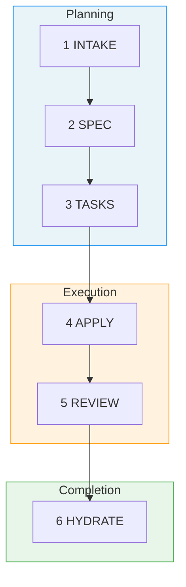

# Fab Kit

A structured development workflow for AI agents. You describe a change, AI plans it, implements it, reviews it, and saves what it learned into shared project memory. Each completed change builds shared context, so future changes start with better knowledge.

Fab Kit is a 6-stage pipeline defined entirely in markdown prompts — no SDK, no vendor lock-in. The skills are plain prompts any AI agent can execute (Claude Code, Codex, Cursor, Windsurf). Copy it into your project and go.

> **[Try it now](#quick-start)** | **[Understand the concepts](#why-fab-kit)**

**Contents:** [The 6 Stages](#the-6-stages) · [Prerequisites](#prerequisites) · [Quick Start](#quick-start) · [Why Fab Kit](#why-fab-kit) · [Commands](#command-quick-reference) · [Learn More](#learn-more)

## The 6 Stages

Every change (a self-contained feature or fix with its own folder) moves through six stages:



| # | Stage | Purpose | Artifact |
|---|-------|---------|----------|
| 1 | **Intake** | Capture intent, scope, approach | `intake.md` |
| 2 | **Spec** | Define requirements | `spec.md` |
| 3 | **Tasks** | Break into implementation checklist | `tasks.md` + `checklist.md` |
| 4 | **Apply** | Execute the tasks | Code changes |
| 5 | **Review** | Sub-agent validates against spec and constitution | Prioritized findings report |
| 6 | **Hydrate** | Save learnings into project memory | Memory updates |

Each stage produces a persistent artifact. Interrupt anything — `/fab-continue` picks up from the last checkpoint.

Review is performed by a **sub-agent** running in a separate context — a fresh perspective that validates against both your spec and [project constitution](#code-quality-as-a-guardrail). Findings are prioritized (must-fix, should-fix, nice-to-have) and the agent triages them, looping back for automatic rework on the issues that matter most.

A change folder looks like this:

```
fab/current/add-spinner/
├── intake.md        # What you want and why
├── spec.md          # Requirements (generated)
├── tasks.md         # Implementation plan (generated)
├── checklist.md     # Progress tracking
└── .status.yaml     # Pipeline state
```

## Prerequisites

Install with [Homebrew](https://brew.sh/) (macOS and Linux):

```bash
brew install yq jq gh bats-core direnv
```

| Tool | Purpose |
|------|---------|
| [yq](https://github.com/mikefarah/yq) | YAML processing for status files and schemas |
| [jq](https://jqlang.github.io/jq/) | JSON processing for settings merge during sync |
| [gh](https://cli.github.com/) | GitHub CLI — used for installation and releases |
| [bats-core](https://github.com/bats-core/bats-core) | Bash test runner for kit validation |
| [direnv](https://direnv.net/) | Auto-loads `.envrc` to put fab scripts on PATH |

After installing `gh`, authenticate with `gh auth login`.

## Quick Start

### 1. Install

#### New project

**From GitHub releases** (requires [gh CLI](https://cli.github.com/) with authentication):

```bash
mkdir -p fab
gh release download --repo wvrdz/fab-kit --pattern 'kit.tar.gz' --output - | tar xz -C fab/
```

#### From a local clone

```bash
cp -r /path/to/fab-kit/fab/.kit ./fab/
```

#### Initialize

**In your terminal:**

```bash
fab/.kit/scripts/fab-sync.sh            # creates directories, symlinks, docs/memory/, .gitignore
direnv allow                            # approve .envrc (adds scripts to PATH)
# No direnv? export PATH="$PWD/fab/.kit/scripts:$PATH"
```

**Then in your AI agent:**

```
/fab-setup    # Claude Code
$fab-setup    # Codex
```

This generates `fab/config.yaml` and `fab/constitution.md` (your project's architectural rules).

#### Updating from a previous version

```bash
fab-upgrade.sh       # downloads latest kit, replaces fab/.kit/, auto-runs fab-sync.sh
```

If the upgrade reports a version mismatch, run `/fab-setup migrations` in your AI agent to apply migrations. Safe to re-run.

To repair symlinks and scaffold structure without downloading a new release (useful when developing fab-kit itself):

```bash
bash fab/.kit/scripts/fab-sync.sh
```

### 2. Your first change

```bash
# In your AI agent:
/fab-new Add a loading spinner to the submit button
  # Creation — creates change folder, writes intake.md, asks clarifying questions
/fab-continue
  # Planning — generates spec.md (structured requirements)
/fab-continue
  # Planning — generates tasks.md (implementation checklist)
/fab-continue
  # Execution — implements the code, checking off tasks as it goes
/fab-continue
  # Execution — reviews implementation against spec + constitution
/fab-continue
  # Completion — saves learnings into docs/memory/
/fab-archive
  # Completion — archives the change folder
```

At any point, run `/fab-status` to see where you are.

For small changes, `/fab-ff` (fast-forward) skips intermediate planning stages — gated by a [confidence score](#structured-autonomy-not-guesswork) that ensures ambiguity is low enough for safe execution. Both `/fab-ff` and `/fab-fff` (full fast-forward) auto-loop between apply and sub-agent review, fixing issues automatically before escalating to you.

### 3. Going parallel

While AI works on one change, start another in a separate [git worktree](https://git-scm.com/docs/git-worktree) (an isolated copy of your repo):

```
/fab-new Add error toast for failed submissions
/fab-switch add-error-toast
```

Each change is a self-contained folder — multiple AI sessions run in parallel without conflicts. [How the assembly line works →](docs/specs/assembly-line.md)

### Troubleshooting

- `direnv allow` doesn't work — reload your shell or run `eval "$(direnv export zsh)"`
- `/fab-setup` not recognized — re-run `fab/.kit/scripts/fab-sync.sh` to repair symlinks

## Why Fab Kit

AI coding tools give you speed but leave you to manage quality and knowledge yourself. Fab Kit gives you all three:

| [**Speed**](#parallel-by-default) | [**Knowledge**](#shared-memory-that-grows-with-your-project) | [**Quality**](#code-quality-as-a-guardrail) | [**Autonomy**](#structured-autonomy-not-guesswork) |
|:---:|:---:|:---:|:---:|
| Parallel changes — never idle | Compounds with every change | Constitution + self-correcting review | SRAD-driven — assumes or asks based on context |

### Parallel by Default

<!-- Diagram: Traditional one-at-a-time workflow vs assembly line. In the traditional approach, you and AI alternate between working and idle. In the assembly line, you create batches of changes while AI executes previous batches — both stay busy. -->
```
  ██ = working    ░░ = idle

              One at a time
              ─────────────

  You    ██░░░░░░░░██░░░░░░░░██░░░░░░░░██░░░░░░░░
  AI     ░░████████░░████████░░████████░░████████

  Create, wait, review. Create, wait, review.
  More waiting than working.


              Assembly line
              ─────────────

  You    ██████░░█████████░██░█████████░██░░░░░░░
  AI     ░░░░░░██████████░████████████░░████████░

  Create a batch, hand off, create the next batch.
  Both always working.
```

Without Fab, you describe a task, wait while AI works, review, repeat. With Fab, you batch structured changes — each in its own folder and worktree — and create the next batch while AI executes the current one.

Three properties make this work:

- **Self-contained change folders** — Each change has its own spec, tasks, and status. No shared state — parallel changes don't interfere during development.
- **Git worktree isolation** — Each change runs in its own [worktree](https://git-scm.com/docs/git-worktree). Parallel AI sessions can't step on each other.
- **Resumable pipeline** — Every stage produces a persistent artifact. Interrupt anything, resume later.

### Shared Memory That Grows With Your Project

Most AI tools give each session a private memory that disappears when the session ends. Fab saves learnings from every completed change into `docs/memory/` — a domain-organized knowledge base committed to git and shared with the entire team.

```
  ┌──────────┐    hydrate     ┌──────────────┐
  │ spec.md  │ ─────────────▶ │ docs/memory/ │
  └──────────┘                └──────┬───────┘
       ▲                             │
       │       context for next      │
       └──────── change ─────────────┘
```

This creates a self-reinforcing cycle:

- **Every change makes the next one better** — Design decisions from `spec.md` merge into memory. Future changes load those files as context, so AI starts with real knowledge of your system instead of guessing.
- **Team knowledge, not personal notes** — Memory lives in git. Every developer and every AI session reads the same source of truth. Onboarding means cloning the repo.
- **Bootstrap from existing docs** — `/docs-hydrate-memory` ingests documentation from Notion, Linear, or local files. The pipeline keeps it current from there.
- **Structured, not append-only** — Memory is organized by domain (`auth/`, `payments/`, `users/`). `/docs-reorg-memory` restructures as it grows. `/docs-hydrate-specs` updates spec files with relevant details from memory.

### Code Quality as a Guardrail

AI writes code fast. Without structure, it also skips requirements, ignores architectural conventions, and ships the first thing that works. Fab enforces quality through structure, a constitution, and self-correcting review.

```
         ┌───────────────────────────┐
         │    fab/constitution.md    │
         │  MUST · SHOULD · MUST NOT │
         └─────────────┬─────────────┘
                       │
  intake → spec → tasks → apply ⇄ review → hydrate
             ↑       ↑       ↑    ↗    │
             └───────┴───────┴────┘    │
                sub-agent review        │
                with prioritized        │
                findings                │
```

- **Stages that can't be skipped** — The pipeline requires intake, spec, and tasks before any code is written. The AI can't jump straight to implementation. Before code is written, the [SRAD framework](#structured-autonomy-not-guesswork) ensures planning decisions are grounded in context — not silently guessed.
- **Project constitution** — `fab/constitution.md` defines your architectural rules using MUST/SHOULD/MUST NOT. Every spec, task breakdown, and review checks against it — not just the change's requirements.
- **Review that fixes, not just flags** — A **sub-agent** reviews in a fresh context, returning prioritized findings. The applying agent triages by severity and loops back to the right stage:

| Review finds | Priority | Loops back to | What happens |
|-------------|----------|---------------|--------------|
| Spec mismatch, failing tests | Must-fix | → apply | Unchecks failed tasks, re-runs them |
| Missing/wrong tasks | Must-fix | → tasks | Revises tasks, re-applies |
| Requirements were wrong | Must-fix | → spec | Updates spec, regenerates tasks |
| Code quality issue | Should-fix | → apply | Addressed when clear and low-effort |
| Style suggestion | Nice-to-have | — | May be skipped |

`/fab-fff` and `/fab-ff` auto-loop between apply and review (up to 3 cycles) — each re-review uses a fresh sub-agent. `/fab-ff` falls back to interactive rework after exhausting auto-retries.

### Structured Autonomy, Not Guesswork

AI tools either ask too many questions or silently assume. Fab uses **SRAD** — a 4-dimension framework — to decide which to do for each decision point during planning.

**S**ignal strength · **R**eversibility · **A**gent competence · **D**isambiguation type

Each dimension scores how safe it is to assume. The scores aggregate into a confidence grade:

| Grade | What happens |
|-------|-------------|
| **Certain** | Proceeds silently — deterministic from config/codebase |
| **Confident** | Proceeds, noted in assumptions summary |
| **Tentative** | Proceeds with marker — resolvable via `/fab-clarify` |
| **Unresolved** | Blocks and asks — too ambiguous to guess |

Grades aggregate into a **confidence score** that gates `/fab-ff`. If ambiguity is too high, the pipeline refuses to run and tells you what to clarify — no silent guesswork, no unnecessary interruption. [How SRAD works →](docs/specs/srad.md)

## Command Quick Reference

> **Prefix:** Use `/fab-*` in Claude Code, `$fab-*` in Codex.

| Command | Purpose |
|---------|---------|
| `/fab-setup` | Bootstrap fab/ structure, manage config/constitution, apply migrations |
| `/fab-new <description>` | Start a new change |
| `/fab-continue` | Advance to next stage |
| `/fab-ff` | Fast-forward from spec with auto-rework loop |
| `/fab-fff` | Full autonomous pipeline with sub-agent rework |
| `/fab-clarify` | Deepen current artifact before moving on |
| `/fab-status` | Check current progress |
| `/fab-switch` | Switch active change |
| `/fab-archive` | Archive a completed change |
| `/docs-hydrate-memory [sources...]` | Ingest external docs into memory |

## Learn More

- **[The Assembly Line](docs/specs/assembly-line.md)** — batch scripts, Gantt charts, and the full numbers behind parallel development
- **[Design & Workflow Details](docs/specs/overview.md)** — principles, detailed stage descriptions, example workflows
- **[User Flow Diagrams](docs/specs/user-flow.md)** — visual maps of the full pipeline, shortcuts, rework paths, and state machine
- **[Full Command Reference](docs/specs/skills.md)** — detailed behavior for every `/fab-*` skill
- **[SRAD Autonomy Framework](docs/specs/srad.md)** — how the pipeline handles ambiguity, confidence scoring, and autonomous execution gates
- **[Glossary](docs/specs/glossary.md)** — all Fab terminology defined
- **[Contributing](CONTRIBUTING.md)** — developing, extending, and releasing Fab Kit
