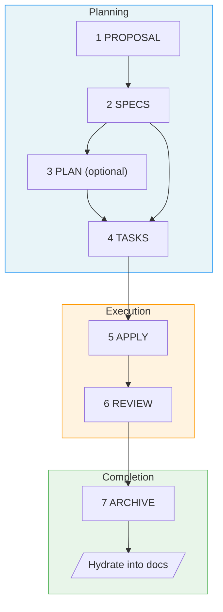
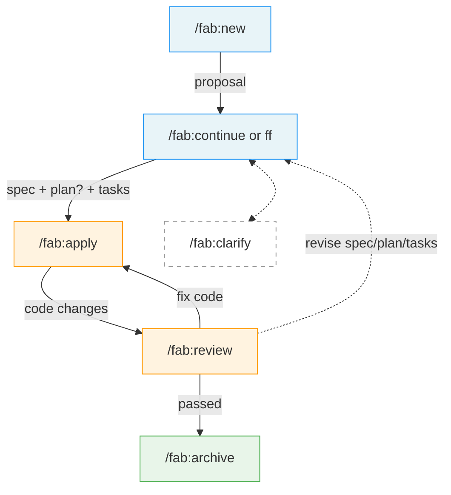

# Fab Workflow Specification

> **Fab** (fabricate) - A Specification-Driven Development workflow

## Overview

A hybrid SDD workflow that combines:
- **SpecKit's** intuitive structure, folder customization, and pure-prompt approach
- **OpenSpec's** fast-forward workflow and centralized doc hydration

---

## Design Principles

### 1. Pure Prompt Play
No system installation required. All workflow logic lives in `fab/.kit/` as markdown templates and skill definitions that any AI agent can execute.

### 2. Docs Are the Source of Truth
Code serves documentation, not the other way around. The centralized docs (`fab/docs/`) are the source of truth for what the system does and why it works the way it does.

### 3. Change Folder First
All work happens in change folders. Each change captures its requirements (`spec.md`) and technical decisions (`plan.md`), which get hydrated into the centralized docs on completion.

### 4. Stage Visibility
Always know where you are. Each change folder has a `.status.yaml` manifest that tracks current stage and progress. A `current` pointer file (`fab/current` contains the active change name) provides instant access to whichever change is in flight — no scanning or guessing required. Run `fab/.kit/scripts/fab-status.sh` for a quick terminal check.

### 5. Skill-Based Interface
Use skills (not rigid commands) for better agent interoperability. Skills are more naturally invocable by AI agents.

### 6. Git-Optional
Fab tracks changes in directories, not branches. But when git is available, `/fab:new` offers to create or adopt a branch and records it in `.status.yaml` for traceability. Commits, pushes, and PRs remain your responsibility — Fab just keeps the link.

---

## Getting Started

### Prerequisites

- An existing project directory (git repo recommended but not required)
- An AI agent that supports skill definitions (e.g., Claude Code, Cursor, Windsurf)

### Bootstrap

Fab's workflow logic lives in `fab/.kit/` — but `.kit/` doesn't exist until you put it there. This is a deliberate two-phase setup:

**Phase 1: Obtain `.kit/`**

Copy the `.kit/` directory into your project:

```bash
mkdir -p fab
cp -r /path/to/fab-kit fab/.kit
```

> `.kit/` is distributed as a standalone directory. See [Distribution](ARCHITECTURE.md#distribution--bootstrapping) for sourcing options. When `.kit/` gets its own repository, this becomes a single clone or download.

**Phase 2: Run `/fab:init`**

```bash
/fab:init
```

This generates everything else: `config.yaml`, `constitution.md`, `docs/`, `changes/`, and skill symlinks. See [Skills Reference](SKILLS.md#fabinit) for full behavior.

### Verify

```bash
fab/.kit/scripts/fab-status.sh
→ "No active change"
```

You're ready. Start your first change with `/fab:new <description>`.

### Hydrating Docs from Existing Sources

After the initial bootstrap, use `/fab:hydrate` to ingest existing documentation into `fab/docs/`:

```bash
# Pull in API docs from Notion
/fab:hydrate https://notion.so/myteam/API-Spec-abc123

# Ingest local legacy docs
/fab:hydrate ./docs/legacy/

# Multiple sources at once
/fab:hydrate https://notion.so/myteam/Auth-xyz https://linear.app/myteam/project/payments-abc ./specs/
```

Supported sources: **Notion URLs**, **Linear URLs**, **local files/directories**. Each run analyzes the content, maps it to domains, and creates or merges into `fab/docs/`. See [Skills Reference](SKILLS.md#fabhydrate-sources) for details.

---

## The 7 Stages



### Stage Details

| # | Stage | Purpose | Artifact | Includes |
|---|-------|---------|----------|----------|
| 1 | **Proposal** | Intent, scope, approach | `proposal.md` | Initial clarification questions |
| 2 | **Specs** | What's changing | `spec.md` | Clarification of ambiguities, [NEEDS CLARIFICATION] markers |
| 3 | **Plan** *(optional)* | How to implement | `plan.md` | Technical research, architecture decisions, dependency analysis |
| 4 | **Tasks** | Implementation checklist | `tasks.md` | Auto-generated quality checklist (`checklists/quality.md`) |
| 5 | **Apply** | Execute tasks | code changes | Run tests per task, progress tracking |
| 6 | **Review** | Validate against spec | validation report | Checklist completion, spec drift detection |
| 7 | **Archive** | Complete & hydrate | archive entry | Hydrate spec + plan into centralized docs |

### User Flow

The 7 stages are internal. From the user's perspective, the main workflow is 5 skill invocations — planning stages (2–4) after proposal are collapsed into a single step via `/fab:ff` or stepped through with `/fab:continue`. `/fab:clarify` is available at any planning stage to deepen the current artifact before moving on:



---

## Quick Reference

| Skill | Purpose | Creates |
|-------|---------|---------|
| `/fab:init` | Bootstrap fab/ structure | `config.yaml`, `constitution.md`, `docs/`, skill symlinks (idempotent) |
| `/fab:hydrate [sources...]` | Ingest external docs into fab/docs/ | Updated `fab/docs/` with indexes |
| `/fab:new` | Start change (optionally with `--branch`) | `proposal.md`, `.status.yaml`, branch (optional) |
| `/fab:continue [<stage>]` | Next artifact (or reset to stage) | Next stage artifact |
| `/fab:ff` | Fast forward remaining planning | spec.md + plan (if needed) + tasks + checklist |
| `/fab:clarify` | Deepen current artifact | Refined artifact (in place) |
| `/fab:apply` | Implement | Code changes |
| `/fab:review` | Validate | Validation report |
| `/fab:archive` | Complete & hydrate | Archive entry, updated docs |
| `/fab:switch` | Change active change | Updated pointer file |
| `/fab:status` | Check progress | Status display |

---

## Example Workflow

### Standard Flow
```bash
# 1. Start new change
/fab:new Add dark mode support with system preference detection

# 2. Proposal generated with clarifying questions
# (answer questions, refine if needed)

# 3. Continue to specs
/fab:continue
# → Creates spec.md with requirements for this change
# → Asks clarifying questions about ambiguities

# 4. Continue to plan
/fab:continue
# → Creates plan.md
# → Does technical research inline

# 5. Continue to tasks
/fab:continue
# → Creates tasks.md with implementation checklist
# → Auto-generates checklists/quality.md

# 6. Implement
/fab:apply
# → Executes tasks, marks completed

# 7. Review
/fab:review
# → Validates implementation, checks checklist

# 8. Archive
/fab:archive
# → Hydrates docs/, moves to archive/
```

### Fast Track (small changes)
```bash
/fab:new Add loading spinner to submit button
/fab:ff
/fab:apply
/fab:review
/fab:archive
```

---

## Further Reading

- [Architecture](ARCHITECTURE.md) — directory structure, config, conventions
- [Skills Reference](SKILLS.md) — detailed behavior for each `/fab:*` skill
- [Templates](TEMPLATES.md) — artifact formats and checklist generation

