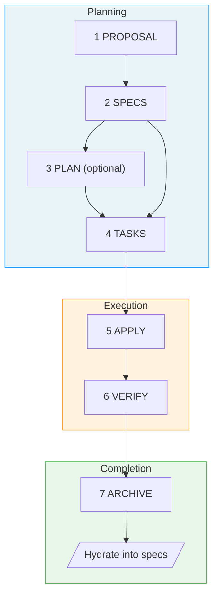
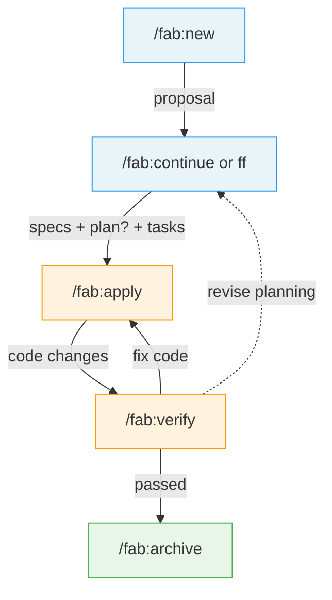

# Fab Workflow Specification

> **Fab** (fabricate) - A Specification-Driven Development workflow

## Overview

A hybrid SDD workflow that combines:
- **SpecKit's** intuitive structure, folder customization, and pure-prompt approach
- **OpenSpec's** fast-forward, delta-based specs, and centralized spec hydration

---

## Design Principles

### 1. Pure Prompt Play
No system installation required. All workflow logic lives in `fab/.kit/` as markdown templates and skill definitions that any AI agent can execute.

### 2. Specs Are King
Code serves specifications, not the other way around. The centralized spec (`specs/`) is the source of truth for what the system does.

### 3. Delta-First Changes
All work happens in change folders. Changes track ADDED/MODIFIED/REMOVED requirements that get hydrated into the centralized spec on completion.

### 4. Stage Visibility
Always know where you are. Each change folder has a `.status.yaml` manifest that tracks current stage and progress. A `current` pointer file (`fab/current` contains the active change name) provides instant access to whichever change is in flight — no scanning or guessing required. Run `fab/.kit/scripts/status.sh` for a quick terminal check.

### 5. Skill-Based Interface
Use skills (not rigid commands) for better agent interoperability. Skills are more naturally invocable by AI agents.

### 6. Git-Agnostic
Fab does not manage git. Branch creation, commits, and pushes are separate concerns handled by your existing git workflow.

---

## The 7 Stages



### Stage Details

| # | Stage | Purpose | Artifact | Includes |
|---|-------|---------|----------|----------|
| 1 | **Proposal** | Intent, scope, approach | `proposal.md` | Initial clarification questions |
| 2 | **Specs** | What's changing (deltas) | `specs/*.md` | Clarification of ambiguities, [NEEDS CLARIFICATION] markers |
| 3 | **Plan** *(optional)* | How to implement | `plan.md` | Technical research, architecture decisions, dependency analysis |
| 4 | **Tasks** | Implementation checklist | `tasks.md` | Auto-generated quality checklist (`checklists/quality.md`) |
| 5 | **Apply** | Execute tasks | code changes | Run tests per task, progress tracking |
| 6 | **Verify** | Validate against specs | validation report | Checklist completion, spec drift detection |
| 7 | **Archive** | Complete & hydrate | archive entry | Delta merge into centralized specs |

### User Flow (5 skills)

The 7 stages are internal. From the user's perspective, the workflow is 5 skill invocations — planning stages (2–4) after proposal are collapsed into a single step via `/fab:ff` or stepped through with `/fab:continue`:



---

## Quick Reference

| Skill | Purpose | Creates |
|-------|---------|---------|
| `/fab:init` | Bootstrap fab/ in a project | `.kit/`, `config.yaml`, `memory/`, skill symlinks |
| `/fab:new` | Start change | `proposal.md`, `.status.yaml` |
| `/fab:continue` | Next artifact | Next stage artifact |
| `/fab:ff` | Fast forward remaining planning | Specs + plan (if needed) + tasks + checklist |
| `/fab:apply` | Implement | Code changes |
| `/fab:verify` | Validate | Validation report |
| `/fab:archive` | Complete & hydrate | Archive entry, updated specs |
| `/fab:switch` | Change active change | Updated pointer file |
| `/fab:status` | Check progress | Status display |

---

## Example Workflow

### Standard Flow
```bash
# 1. Start new change
/fab:new Add dark mode support with system preference detection

# 2. Proposal generated with clarifying questions
# (answer questions, refine if needed)

# 3. Continue to specs
/fab:continue
# → Creates specs/ui/theming.md with ADDED requirements
# → Asks clarifying questions about ambiguities

# 4. Continue to plan
/fab:continue
# → Creates plan.md
# → Does technical research inline

# 5. Continue to tasks
/fab:continue
# → Creates tasks.md with implementation checklist
# → Auto-generates checklists/quality.md

# 6. Implement
/fab:apply
# → Executes tasks, marks completed

# 7. Verify
/fab:verify
# → Validates implementation, checks checklist

# 8. Archive
/fab:archive
# → Hydrates specs/, moves to archive/
```

### Fast Track (small changes)
```bash
/fab:new Add loading spinner to submit button
/fab:ff
/fab:apply
/fab:verify
/fab:archive
```

---

## Further Reading

- [Architecture](ARCHITECTURE.md) — directory structure, config, conventions
- [Skills Reference](SKILLS.md) — detailed behavior for each `/fab:*` skill
- [Templates](TEMPLATES.md) — artifact formats and checklist generation

