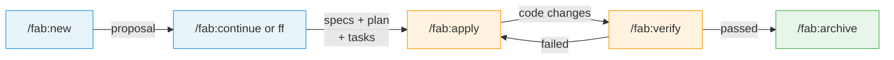

# Fab Workflow Specification

> **Fab** (fabricate) - A Specification-Driven Development workflow

## Overview

A hybrid SDD workflow that combines:
- **SpecKit's** intuitive structure, folder customization, and pure-prompt approach
- **OpenSpec's** fast-forward, delta-based specs, and centralized spec hydration

---

## Design Principles

### 1. Pure Prompt Play
No system installation required. All workflow logic lives in `fab/.kit/` as markdown templates and skill definitions that any AI agent can execute.

### 2. Specs Are King
Code serves specifications, not the other way around. The centralized spec (`specs/`) is the source of truth for what the system does.

### 3. Delta-First Changes
All work happens in change folders. Changes track ADDED/MODIFIED/REMOVED requirements that get hydrated into the centralized spec on completion.

### 4. Stage Visibility
Always know where you are. Each change folder has a `.status.yaml` manifest that tracks current stage and progress. A `current` symlink (`fab/current → fab/changes/{active-change}`) provides instant access to whichever change is in flight — no scanning or guessing required.

### 5. Skill-Based Interface
Use skills (not rigid commands) for better agent interoperability. Skills are more naturally invocable by AI agents.

### 6. Git-Agnostic
Fab does not manage git. Branch creation, commits, and pushes are separate concerns handled by your existing git workflow.

---

## The 7 Stages

```
┌─────────────────────────────────────────────────────────────────────────────┐
│                              FAB WORKFLOW                                    │
├─────────────────────────────────────────────────────────────────────────────┤
│                                                                              │
│  ┌──────────┐    ┌──────────┐    ┌──────────┐    ┌──────────┐              │
│  │ PROPOSAL │ ─→ │  SPECS   │ ─→ │   PLAN   │ ─→ │  TASKS   │              │
│  │   (1)    │    │   (2)    │    │   (3)    │    │   (4)    │              │
│  │          │    │ +clarify │    │ +research│    │ +checklist│             │
│  └──────────┘    └──────────┘    └──────────┘    └──────────┘              │
│       │                                               │                     │
│       │              /fab:ff                          │                     │
│       └─────────────────────────────────────────────→│                     │
│                                                       │                     │
│                                                       ↓                     │
│                              ┌──────────┐    ┌──────────────┐              │
│                              │  VERIFY  │ ←─ │    APPLY     │              │
│                              │   (6)    │    │     (5)      │              │
│                              └────┬─────┘    └──────────────┘              │
│                                   │                                         │
│                                   ↓                                         │
│                              ┌──────────┐                                   │
│                              │ ARCHIVE  │                                   │
│                              │   (7)    │                                   │
│                              └──────────┘                                   │
│                                   │                                         │
│                                   ↓                                         │
│                         Hydrate into specs/                                 │
│                                                                              │
└─────────────────────────────────────────────────────────────────────────────┘
```

### Stage Details

| # | Stage | Purpose | Artifact | Includes |
|---|-------|---------|----------|----------|
| 1 | **Proposal** | Intent, scope, approach | `proposal.md` | Initial clarification questions |
| 2 | **Specs** | What's changing (deltas) | `specs/*.md` | Ambiguity resolution, [NEEDS CLARIFICATION] markers |
| 3 | **Plan** | How to implement | `plan.md` | Technical research, architecture decisions |
| 4 | **Tasks** | Implementation checklist | `tasks.md` | Auto-generated quality checklist |
| 5 | **Apply** | Execute tasks | code changes | Progress tracking |
| 6 | **Verify** | Validate against specs | validation report | Checklist completion check |
| 7 | **Archive** | Complete & hydrate | archive entry | Delta merge into centralized specs |

### User Flow (5 skills)

The 7 stages are internal. From the user's perspective, the workflow is 5 skill invocations — planning stages (1–4) are collapsed into a single step via `/fab:ff` or stepped through with `/fab:continue`:



---

## Directory Structure

```
project/
├── fab/
│   ├── .kit/                       # Engine — hidden, rarely touched
│   │   ├── config.yaml             # Project configuration
│   │   ├── memory/
│   │   │   └── constitution.md     # Project principles & constraints
│   │   ├── templates/
│   │   │   ├── proposal.md
│   │   │   ├── spec.md
│   │   │   ├── plan.md
│   │   │   ├── tasks.md
│   │   │   └── checklist.md
│   │   └── skills/                 # Skill definitions (markdown prompts)
│   │       ├── fab-init.md
│   │       ├── fab-new.md
│   │       ├── fab-continue.md
│   │       ├── fab-ff.md
│   │       ├── fab-apply.md
│   │       ├── fab-verify.md
│   │       ├── fab-archive.md
│   │       ├── fab-switch.md
│   │       └── fab-status.md
│   ├── current → changes/add-oauth # Symlink to active change
│   ├── specs/                      # Centralized source of truth
│   │   ├── auth/
│   │   │   └── authentication.md
│   │   ├── payments/
│   │   │   └── checkout.md
│   │   └── ...
│   └── changes/
│       ├── add-oauth/              # Active change
│       │   ├── .status.yaml        # Stage tracking
│       │   ├── proposal.md
│       │   ├── specs/
│       │   │   └── auth/
│       │   │       └── authentication.md  # Delta spec
│       │   ├── plan.md
│       │   ├── tasks.md
│       │   └── checklists/
│       │       └── quality.md      # Auto-generated
│       └── archive/                # Completed changes
│           └── 2024-01-15-add-2fa/
└── .claude/                        # Agent-specific skill exports
    └── skills/
```

### Folder Naming Convention

**Changes**: Descriptive kebab-case → `add-oauth`, `fix-checkout-bug`, `refactor-auth`

**Archive**: Date-prefixed → `2024-01-15-add-oauth`

**Configurable** via `config.yaml`:
```yaml
naming:
  changes: "{action}-{feature}"     # e.g., add-oauth
  archive: "{date}-{name}"          # e.g., 2024-01-15-add-oauth
```

---

## Active Change Tracking (`fab/current`)

`fab/current` is a symlink that always points to the change folder you're actively working on. Inspired by SpecKit's `.specify/current`, it removes the need to scan `changes/` or remember folder names.

**Lifecycle**:
- **Created** by `/fab:new` — points to the newly created change folder
- **Updated** by `/fab:new` — if you start a new change, the symlink moves
- **Read** by every other skill — `/fab:continue`, `/fab:apply`, `/fab:verify`, `/fab:status` all resolve the active change via `current` rather than requiring a name argument
- **Removed** by `/fab:archive` — after archiving, there is no active change

**Switching between changes**: If multiple change folders exist and you want to switch context:
```
/fab:switch add-oauth
→ "fab/current now points to add-oauth"
```

**Why a symlink?**
- Works with all tools (`cat fab/current/.status.yaml` just works)
- No parsing required — the filesystem _is_ the pointer
- Git-friendly — add `fab/current` to `.gitignore` since it's local working state. Everything else in `fab/` is committed and shared.

---

## Status Tracking (.status.yaml)

Every change folder contains a `.status.yaml` manifest:

```yaml
name: add-oauth
created: 2024-01-10T14:30:00Z
stage: plan                 # Current stage
progress:
  proposal: complete
  specs: complete
  plan: in_progress
  tasks: pending
  apply: pending
  verify: pending
  archive: pending
checklist:
  generated: true
  path: checklists/quality.md
  completed: 0
  total: 12
last_updated: 2024-01-11T09:15:00Z
```

---

## Skills Reference

### `/fab:init`

**Purpose**: Bootstrap `fab/` in an existing project.

**Creates**:
- `fab/.kit/config.yaml` — project configuration (prompts for name, tech stack, conventions)
- `fab/.kit/memory/constitution.md` — project principles and constraints (generated from conversation or existing docs)
- `fab/.kit/templates/` — default templates for each artifact type
- `fab/.kit/skills/` — skill prompt files
- `fab/specs/` — empty, ready for centralized specs
- `fab/changes/` — empty, ready for change folders

**Example**:
```
/fab:init
→ "What's the project name?"
→ "Describe the tech stack and conventions..."
→ "fab/ initialized with config, templates, and empty specs."
```

**Behavior**:
1. Check if `fab/` already exists (abort if so, suggest manual edits)
2. Prompt for project name, description, tech stack
3. Generate `config.yaml` from responses
4. Generate `constitution.md` from project context (README, existing docs, conversation)
5. Copy default templates into `fab/.kit/templates/`
6. Optionally scaffold initial specs from existing code or documentation

---

### `/fab:new <description>`

**Purpose**: Start a new change from a natural language description.

**Creates**:
- Change folder with sanitized name
- `.status.yaml` manifest
- `proposal.md` from template (with clarifying questions if ambiguous)

**Example**:
```
/fab:new Add OAuth2 support for Google and GitHub sign-in
```

**Behavior**:
1. Sanitize description → folder name
2. Create `fab/changes/{name}/`
3. Initialize `.status.yaml` with stage: proposal
4. Generate `proposal.md` using template
5. Ask clarifying questions if intent is ambiguous
6. Mark proposal complete when satisfied

---

### `/fab:continue`

**Purpose**: Create the next artifact in sequence.

**Example**:
```
/fab:continue
→ "Stage: proposal (complete). Next: Create delta specs."
```

**Behavior**:
1. Read `.status.yaml` to determine current stage
2. Identify next artifact to create
3. Load relevant template + context
4. Generate artifact (with clarification/research as needed)
5. Auto-generate checklist when creating tasks
6. Update `.status.yaml`

---

### `/fab:ff` (Fast Forward)

**Purpose**: Generate all planning artifacts in one pass.

**Flow**: proposal → specs → plan → tasks (+ checklist)

**When to use**:
- Small, well-understood changes
- Clear requirements upfront
- Want to reach implementation quickly

**Example**:
```
/fab:ff Add a logout button to the navbar that clears session
```

**Behavior**:
1. Create proposal from description
2. Generate delta specs (ask clarifying questions inline)
3. Draft plan (do research inline)
4. Produce task breakdown
5. Auto-generate quality checklist
6. Update status to `tasks: complete`

---

### `/fab:apply`

**Purpose**: Execute tasks from `tasks.md`.

**Example**:
```
/fab:apply
→ "Starting implementation. 12 tasks remaining."
```

**Behavior**:
1. Parse `tasks.md` for unchecked items `- [ ]`
2. Execute tasks in dependency order
3. Respect parallel markers `[P]`
4. After completing each task, run relevant tests (e.g., the test file for the module just modified). Fix failures before moving on.
5. Mark each task `[x]` immediately upon completion (not batched at the end)
6. Update `.status.yaml` progress after each task

**Resumability**: `/fab:apply` is inherently resumable. If the agent is interrupted mid-run, re-invoking `/fab:apply` picks up from the first unchecked item. The markdown checklist *is* the progress state — no separate tracking needed.

---

### `/fab:verify`

**Purpose**: Validate implementation against specs and checklists.

**Example**:
```
/fab:verify
→ "✓ 12/12 tasks complete"
→ "✓ 10/12 checklist items passed"
→ "✗ 2 items need attention: [CHK-007, CHK-011]"
```

**Checks**:
- All tasks in `tasks.md` completed
- All checklist items in `checklists/` passed
- Run tests affected by the change (not necessarily the full suite — scoped to modules touched by this change)
- Features match spec requirements
- No spec drift detected

---

### `/fab:archive`

**Purpose**: Complete the change and hydrate into centralized specs.

**Example**:
```
/fab:archive
→ "Archived to fab/changes/archive/2024-01-15-add-oauth/"
→ "Hydrated specs: fab/specs/auth/authentication.md"
```

**Behavior**:
1. Final validation (verify must pass)
2. Hydrate delta specs into `fab/specs/`:
   The agent reads the delta specs and the current centralized spec, then rewrites the centralized spec to incorporate the changes. The ADDED/MODIFIED/REMOVED markers are **semantic hints to the agent about intent**, not instructions for a text processor:
   - **ADDED** → agent integrates new requirements into the appropriate section
   - **MODIFIED** → agent updates the existing requirement in context, preserving surrounding content
   - **REMOVED** → agent removes the requirement, adjusting related content for coherence
   The agent should minimize edits to unchanged sections to prevent drift over successive archives.
3. Move change folder to `archive/` with date prefix
4. Update status to `archived`

---

### `/fab:switch <change-name>`

**Purpose**: Switch the active change when multiple changes exist.

**Example**:
```
/fab:switch fix-checkout-bug
→ "fab/current now points to fix-checkout-bug"
```

**Behavior**:
1. Verify `change-name` exists in `fab/changes/`
2. Update `fab/current` symlink to point to it
3. Display the switched change's status summary

---

### `/fab:status`

**Purpose**: Show current change state at a glance.

**Example output**:
```
Change: add-oauth
Stage:  plan (3/7)

Progress:
  ✓ proposal    complete
  ✓ specs       complete
  ◉ plan   in_progress
  ○ tasks       pending
  ○ apply       pending
  ○ verify      pending
  ○ archive     pending

Checklist: not yet generated (created at tasks stage)

Next: Complete plan.md, then /fab:continue
```

---

## Auto-Generated Checklists

When `/fab:continue` or `/fab:ff` creates `tasks.md`, it also generates `checklists/quality.md`:

```markdown
# Quality Checklist: add-oauth

**Generated**: 2024-01-11
**Change**: add-oauth
**Spec**: specs/auth/authentication.md

---

## Functional Completeness
- [ ] CHK-001 All ADDED requirements have corresponding tasks
- [ ] CHK-002 All MODIFIED requirements update existing behavior correctly
- [ ] CHK-003 All REMOVED requirements are actually removed

## Security
- [ ] CHK-004 OAuth tokens stored securely (not in localStorage)
- [ ] CHK-005 CSRF protection on OAuth callback
- [ ] CHK-006 Token refresh logic handles expiry

## Testing
- [ ] CHK-007 Happy path covered
- [ ] CHK-008 Error states handled (provider unavailable, user denies)
- [ ] CHK-009 Edge cases addressed

## UX
- [ ] CHK-010 Loading states during OAuth redirect
- [ ] CHK-011 Clear error messages on failure
- [ ] CHK-012 Logout properly clears OAuth session

---

## Notes
- Check items as you verify: `[x]`
- All items must pass before `/fab:archive`
```

**Checklist generation is contextual** - items are derived from:
- The delta specs (what's being added/modified/removed)
- The plan (technical decisions)
- Project constitution (quality standards)

---

## Delta Spec Format

```markdown
# Authentication Specification Changes

## ADDED Requirements

### Requirement: OAuth2 Provider Support
The system SHALL support authentication via external OAuth2 providers.

#### Supported Providers
- Google (OpenID Connect)
- GitHub (OAuth2)

#### Scenario: OAuth Login Flow
- GIVEN a user on the login page
- WHEN they click "Sign in with Google"
- THEN they are redirected to Google's OAuth consent screen
- AND upon approval, they are authenticated and redirected back

---

## MODIFIED Requirements

### Requirement: Session Management
The system SHALL support sessions from multiple auth sources.

**Previous**: Sessions tied to email/password only
**New**: Sessions may originate from OAuth providers or email/password

---

## REMOVED Requirements

### Requirement: Email-Only Registration
<!-- Deprecated: Users can now register via OAuth without email -->
```

---

## Configuration (config.yaml)

```yaml
# fab/.kit/config.yaml

project:
  name: "My App"
  description: "App description"

context: |
  Tech stack: TypeScript, React, Node.js, PostgreSQL
  API style: REST with OpenAPI specs
  Auth: JWT tokens with refresh rotation

naming:
  changes: "{action}-{feature}"
  archive: "{date}-{name}"

stages:
  - id: proposal
    generates: proposal.md
    required: true
  - id: specs
    generates: specs/*.md
    requires: [proposal]
    required: true
  - id: plan
    generates: plan.md
    requires: [proposal]
    required: false              # Optional for small changes
  - id: tasks
    generates: tasks.md
    requires: [specs]
    required: true
    auto_checklist: true         # Generate checklist automatically
  - id: apply
    requires: [tasks]
  - id: verify
    requires: [apply]
  - id: archive
    requires: [verify]

checklist:
  categories:
    - functional
    - security
    - testing
    - ux
    - performance                # Add project-specific categories

rules:
  plan:
    - Include data flow diagrams for API changes
    - Document breaking changes explicitly
  specs:
    - Use GIVEN/WHEN/THEN for scenarios
    - Mark ambiguities with [NEEDS CLARIFICATION]
```

---

## Agent Integration

Skills export to agent-specific formats:

### Claude Code (`.claude/skills/`)
```yaml
# .claude/skills/fab-new.md
---
name: fab-new
description: Start a new Fab change
---
[Skill prompt content]
```

### Cursor (`.cursor/rules/`)
Equivalent rules generated for Cursor.

### Extensible
Add adapters for Windsurf, Cline, Copilot, etc.

---

## Example Workflow

### Standard Flow
```bash
# 1. Start new change
/fab:new Add dark mode support with system preference detection

# 2. Proposal generated with clarifying questions
# (answer questions, refine if needed)

# 3. Continue to specs
/fab:continue
# → Creates specs/ui/theming.md with ADDED requirements
# → Asks clarifying questions about ambiguities

# 4. Continue to plan
/fab:continue
# → Creates plan.md
# → Does technical research inline

# 5. Continue to tasks
/fab:continue
# → Creates tasks.md with implementation checklist
# → Auto-generates checklists/quality.md

# 6. Implement
/fab:apply
# → Executes tasks, marks completed

# 7. Verify
/fab:verify
# → Validates implementation, checks checklist

# 8. Archive
/fab:archive
# → Hydrates specs/, moves to archive/
```

### Fast Track (small changes)
```bash
/fab:ff Add loading spinner to submit button
/fab:apply
/fab:verify
/fab:archive
```

---

## Quick Reference

| Skill | Purpose | Creates |
|-------|---------|---------|
| `/fab:init` | Bootstrap fab/ in a project | `.kit/` (config, templates, skills), empty specs |
| `/fab:new` | Start change | `proposal.md`, `.status.yaml` |
| `/fab:continue` | Next artifact | Next stage artifact |
| `/fab:ff` | Fast forward planning | All planning artifacts + checklist |
| `/fab:apply` | Implement | Code changes |
| `/fab:verify` | Validate | Validation report |
| `/fab:archive` | Complete & hydrate | Archive entry, updated specs |
| `/fab:switch` | Change active change | Updated symlink |
| `/fab:status` | Check progress | Status display |

---

## Next Steps

1. Create `fab/` directory structure
2. Write skill prompt files for each `/fab:*` skill
3. Create templates for each artifact type
4. Define checklist generation logic
5. Set up agent export adapters
6. Test workflow on a real feature
