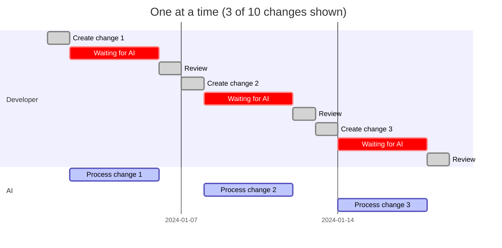
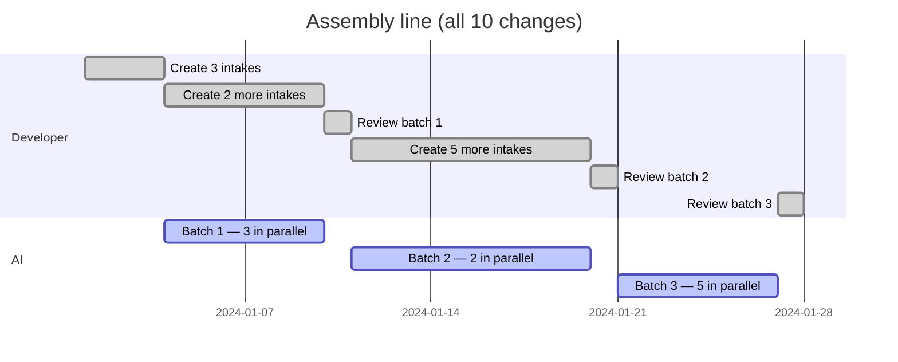

# The Assembly Line

You've felt this: describe a change, wait while AI works, review, describe the next one. Repeat. Half your day is waiting. The other half is context-switching between "thinking about what to build" and "watching AI build it."

FabKit breaks this loop. Every change is a self-contained folder with its own spec, tasks, and status. Hand an entire batch to AI — each change in its own git worktree — and start creating the next batch while it works. You're never waiting. AI is never idle.

---

## Side by Side

### One at a time

You create a change, wait for AI, review, repeat. Most of your time is spent waiting.



The pattern repeats for each change. For 10 changes: **~60 time units, developer idle 67% of the time.**

### Assembly line

You create a batch of intakes, hand them to AI, and immediately start creating the next batch. AI processes each batch in parallel — one worktree per change, one tmux tab per session. Both you and AI are always working.



Same 10 changes. **~27 time units, developer idle <10% of the time.**

---

## The Numbers

|  | One at a time | Assembly line |
|--|---------------|---------------|
| 10 changes completed in | ~60 time units | ~27 time units |
| Speedup | baseline | **2.2x** |
| Developer idle | ~67% | **<10%** |
| AI utilization | ~33% | **~85%** |

The gap widens with scale. Twenty changes? The serial developer is still creating and waiting, one at a time. The assembly-line developer shipped them all in the same wall-clock window.

---

## What It Feels Like

A real morning with 5 changes from your backlog:

| Time | You | AI |
|------|-----|----|
| 9:00 | `fab batch new --all` — 5 tmux tabs open. Hop between them, answer clarifying questions, shape each intake. | — |
| 9:25 | Intakes done. `fab batch switch --all` — 5 worktrees created, 5 Claude sessions open. Run `/fab-fff` in each tab. | Starts speccing, planning, implementing all 5 in parallel. |
| 9:30 | Start creating next batch of intakes from backlog. Or do deep work — design, architecture, code review. | Working. Each change progresses independently through spec → tasks → apply → review → hydrate. |
| 10:15 | — | First 3 changes complete. Waiting for review. |
| 10:15 | Review 3 completed changes. Merge, archive. | Still working on remaining 2. |
| 10:30 | Send next batch. | Finishes remaining 2. Picks up new batch. |

The rhythm: **create → hand off → create → review → hand off → create.** You and AI leapfrog each other. The bottleneck shifts from "waiting for AI" to "how fast can you define what needs to be built."

---

## How It Works

### 1. Create a batch of intakes

Describe each change with `/fab-new` — just the intent, a few minutes each. Or point `fab batch new --all` at your backlog to open a tmux tab per item:

```bash
fab batch new --all
# Opens N tmux tabs, each running Claude with /fab-new <description>
# Hop between tabs, answer clarifying questions, done
```

### 2. Hand off to AI

Once intakes are ready, send them all to AI in parallel:

```bash
fab batch switch --all
# Creates a git worktree per change
# Opens a tmux tab per change with a Claude session
# Run /fab-fff in each tab — AI takes over
```

Each change runs the full 6-stage pipeline (spec, tasks, apply, review, hydrate) independently. Worktree isolation means zero conflicts between parallel changes.

### 3. While AI works, create the next batch

Go back to step 1. When AI finishes, review the results, merge, and archive:

```bash
fab batch archive --all
# Archives all completed changes in one pass
```

Then send the next batch. The cycle repeats — you're never waiting, AI is never idle.

---

## Why This Works

Three properties make the assembly line possible. Remove any one, and batching falls apart:

1. **Self-contained change folders** — each change has its own intake, spec, tasks, and status. No shared state between changes. No conflicts.
2. **Git worktree isolation** — each change runs in its own worktree. Parallel AI sessions can't step on each other. No merge hell.
3. **Resumable pipeline** — if anything interrupts, `/fab-continue` picks up from the last completed stage. No lost progress.

These aren't bolted-on features. They're architectural decisions that make the assembly line a natural consequence of how Fab works.
