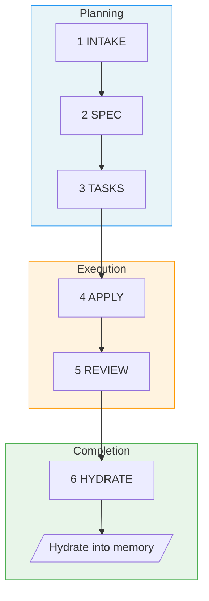

# Fab Workflow Specification

> **Fab** (fabricate) - A Specification-Driven Development workflow

## Overview

A hybrid SDD workflow that combines:
- **SpecKit's** intuitive structure, folder customization, and pure-prompt approach
- **OpenSpec's** fast-forward workflow and memory hydration

---

## Background

Fab combines ideas from two specification-driven workflows — SpecKit and OPSX — taking the best of each:

**From SpecKit**: Intuitive commands, great file locations, obvious stages, easy customization, modifiable folder naming, and a pure-prompt approach with no system installation required.

**From OPSX**: The `fast-forward` command, post-work archiving with centralized spec hydration, separate changes and specs, and skill-based (not command-based) interfaces for better agent interoperability.

**Pain points addressed**: SpecKit lacked centralized specs. OPSX made it hard to see current status, had rigid commands, and offered less control over folder naming.

---

## Design Principles

### 1. Pure Prompt Play
No system installation required. All workflow logic lives in `fab/.kit/` as markdown templates and skill definitions that any AI agent can execute.

### 2. Memory Is the Source of Truth
Code serves documentation, not the other way around. The memory files (`docs/memory/`) are the source of truth for what the system does and why it works the way it does.

### 3. Change Folder First
All work happens in change folders. Each change captures its requirements (`spec.md`), which get hydrated into memory files on completion.

### 4. Stage Visibility
Always know where you are. Each change folder has a `.status.yaml` manifest that tracks current stage and progress. The `.fab-status.yaml` symlink at repo root points to the active change's `.status.yaml`, providing instant access to whichever change is in flight — no scanning or guessing required. Run `/fab-status` for a quick check.

### 5. Skill-Based Interface
Use skills (not rigid commands) for better agent interoperability. Skills are more naturally invocable by AI agents.

### 6. Git-Optional
Fab tracks changes in directories, not branches. A change folder is the unit of identity — the same change can be worked on across multiple branches, worktrees, or even repos. When git is available, `/fab-switch` offers to create or adopt a branch, but no branch information is stored in `.status.yaml`. Commits, pushes, and PRs remain your responsibility — Fab never couples its state to git state.

---

## Getting Started

For installation and setup, see the [Quick Start in the README](../../README.md#quick-start).

**Prerequisites**: An existing project directory (git repo recommended but not required) and an AI agent that supports skill definitions (e.g., Claude Code, Cursor, Windsurf).

After bootstrapping, use `/docs-hydrate-memory` to ingest existing documentation (Notion URLs, Linear URLs, local files) into `docs/memory/`. See [Skills Reference](skills.md#docs-hydrate-memory-sources) for details.

---

## The 6 Stages

Changes progress through 6 stages:



### Stage Details

| # | Stage | Purpose | Artifact | Includes |
|---|-------|---------|----------|----------|
| 1 | **Intake** | Intent, scope, approach | `intake.md` | Created by `/fab-new` with adaptive SRAD-driven questioning |
| 2 | **Spec** | What's changing | `spec.md` | Clarification of ambiguities, [NEEDS CLARIFICATION] markers |
| 3 | **Tasks** | Implementation checklist | `tasks.md` | Auto-generated quality checklist (`checklist.md`) |
| 4 | **Apply** | Execute tasks | code changes | Run tests per task, progress tracking |
| 5 | **Review** | Validate via sub-agent | validation report | Sub-agent review with prioritized findings (must-fix / should-fix / nice-to-have) |
| 6 | **Hydrate** | Complete & hydrate | memory updates | Hydrate spec into memory files |

### User Flow

For detailed visual maps of how commands connect — including shortcuts, rework paths, and the full state machine — see **[User Flow Diagrams](user-flow.md)**.

---

## Quick Reference

| Skill | Purpose | Creates |
|-------|---------|---------|
| `/fab-setup` | Bootstrap fab/ structure | `config.yaml`, `constitution.md`, `memory/`, skill symlinks (idempotent) |
| `/docs-hydrate-memory [sources...]` | Ingest external sources into docs/memory/ | Updated `docs/memory/` with indexes |
| `/fab-new` | Start change (optionally with `--switch`) | `intake.md`, `.status.yaml` |
| `/fab-continue [<stage>]` | Next artifact (or reset to stage) | Next stage artifact |
| `/fab-ff` | Fast-forward through hydrate (confidence-gated) | spec + tasks + checklist + apply + sub-agent review + hydrate |
| `/fab-fff` | Fast-forward-further through review-pr (confidence-gated) | All artifacts through hydrate + ship + review-pr |
| `/fab-clarify` | Deepen current artifact | Refined artifact (in place) |
| `/fab-continue` → apply | Implement | Code changes |
| `/fab-continue` → review | Validate (sub-agent) | Prioritized findings report |
| `/fab-continue` → hydrate | Complete & hydrate | Updated memory |
| `/fab-archive` | Archive completed change | Folder moved to archive/ |
| `/fab-switch` | Change active change | Updated pointer file |
| `/fab-status` | Check progress | Status display |
| `/fab-discuss` | Prime agent with project context for discussion | — (read-only) |
| `batch-fab-new-backlog.sh` | Create changes from backlog items | Worktree + tmux tab per item |
| `batch-fab-switch-change.sh` | Switch to existing changes | Worktree + tmux tab per change |
| `batch-fab-archive-change.sh` | Archive completed changes | Worktree + tmux tab per change |

---

## Example Workflow

### Standard Flow
```bash
# 1. Start new change
/fab-new Add dark mode support with system preference detection

# 2. Intake generated with clarifying questions
# (answer questions, refine if needed)

# 3. Continue to spec
/fab-continue
# → Creates spec.md with requirements for this change
# → Asks clarifying questions about ambiguities

# 4. Continue to tasks
/fab-continue
# → Creates tasks.md with implementation checklist
# → Auto-generates checklist.md

# 5. Implement
/fab-continue
# → Executes tasks, marks completed

# 6. Review
/fab-continue
# → Validates implementation, checks checklist

# 7. Archive
/fab-continue
# → Hydrates memory/, moves to archive/
```

### Fast Track (small changes)
```bash
/fab-new Add loading spinner to submit button
/fab-ff
/fab-continue
/fab-continue
/fab-continue
```

---

## Further Reading

- [User Flow Diagrams](user-flow.md) — visual maps of the full pipeline, shortcuts, rework paths, and state machine
- [Architecture](architecture.md) — directory structure, config, conventions
- [Skills Reference](skills.md) — detailed behavior for each `/fab-*` skill
- [Templates](templates.md) — artifact formats and checklist generation

