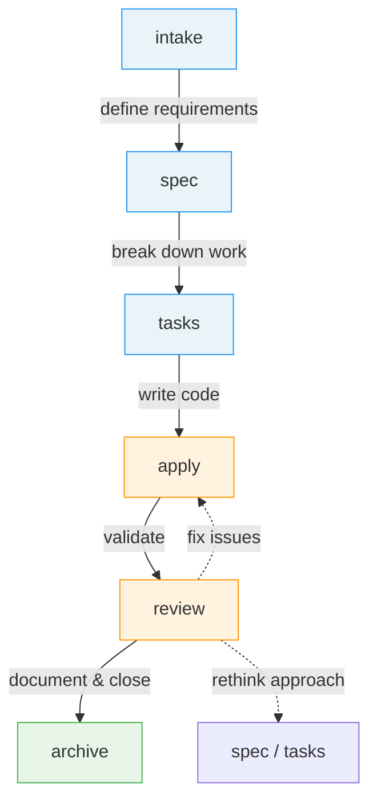
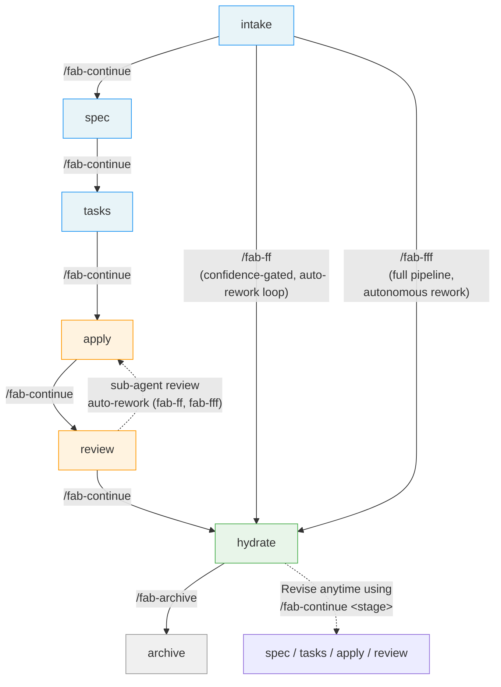
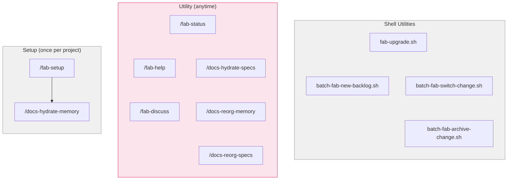
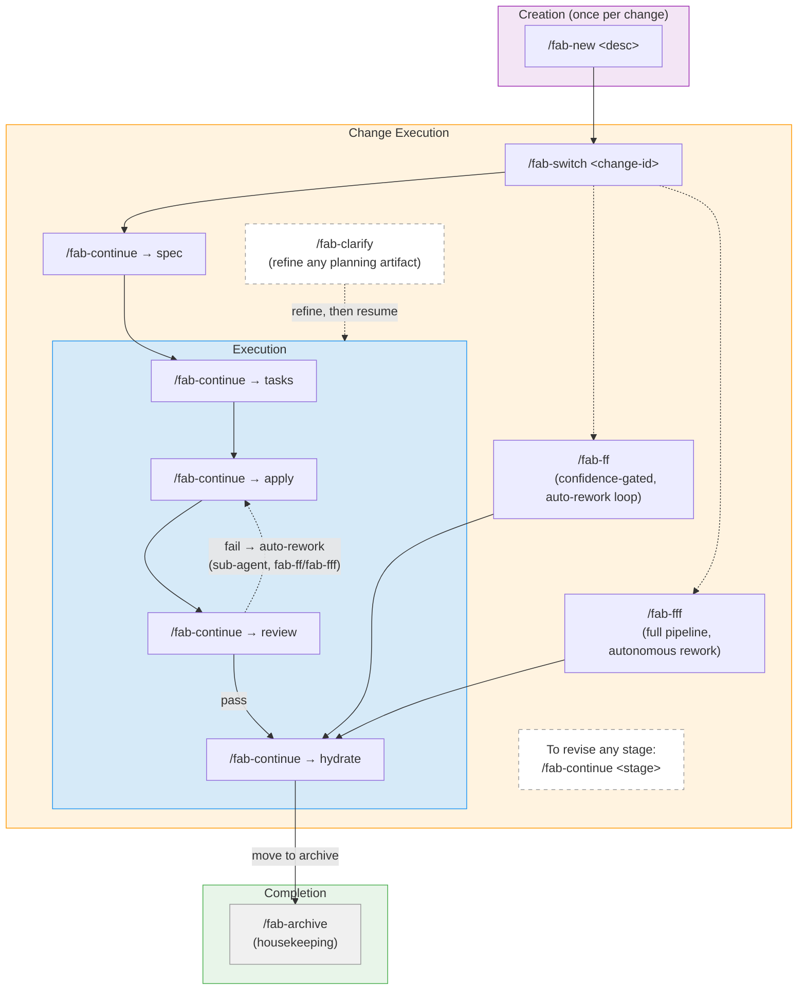
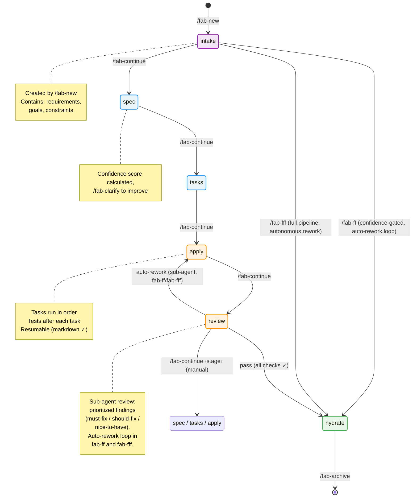
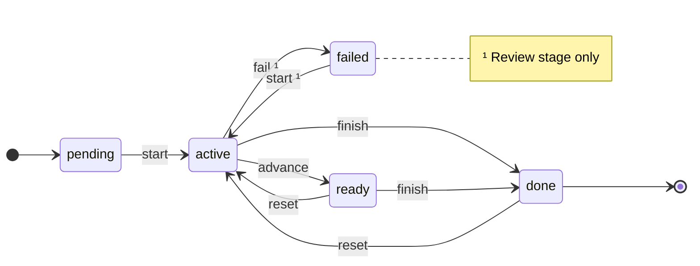

# User Flow Diagrams

> Visual maps of the Fab workflow — how commands connect and what each flow looks like in practice.

---

## 1. How Development Works Today

The stages every developer already follows — define what to build, design it, break it down, code it, review it, close it. Fab doesn't invent new stages; it gives each one a name and a place.

---

## 2. The Same Flow, With Fab

Each transition is now a `/fab-*` command. Shortcuts (`/fab-ff`, `/fab-fff`) run the full pipeline in one invocation. `/fab-archive` is a separate housekeeping step after the pipeline completes.

---

## 3A. Setup & Utilities

Commands that live outside the change pipeline — run once per project or anytime.

## 3B. Change Flow

The pipeline for a single change: creation, execution (with shortcuts), and completion. Solid arrows are the primary flow; dashed arrows are lateral/utility actions.

---

## 4. Change State Diagram

The complete state machine showing how a change progresses through all stages. Each stage can be in one of five states: `pending`, `active`, `ready`, `done`, or `failed` (review only). The diagram shows normal forward flow, shortcuts, rework paths, and the commands that cause each transition.

---

## 5. Per-Stage State Machine

Section 4 shows which *stage* a change is at. This section shows how each individual stage transitions between *states*. Every stage tracks its own progress as one of: `pending`, `active`, `ready`, `done` (and `failed` for review). The events that drive transitions are issued by `statusman.sh`.

### Side-effects

| Event | Side-effect |
|-------|-------------|
| **finish** | If the next stage in the pipeline is `pending`, it is automatically set to `active` |
| **reset** | All downstream stages are cascaded to `pending` |

Source of truth: [`fab/.kit/schemas/workflow.yaml`](../../fab/.kit/schemas/workflow.yaml)
