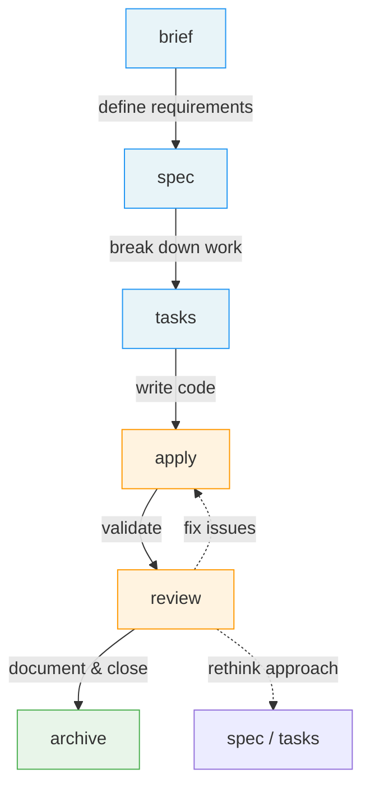
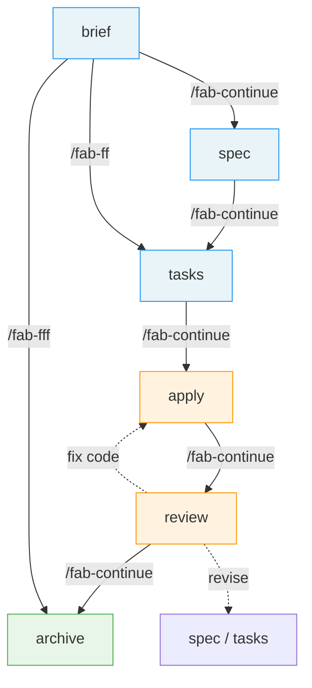
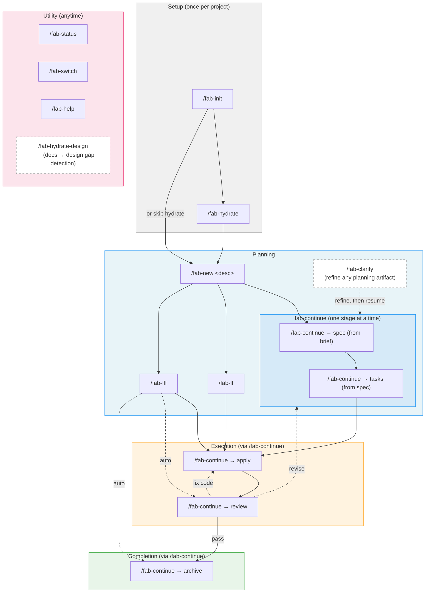
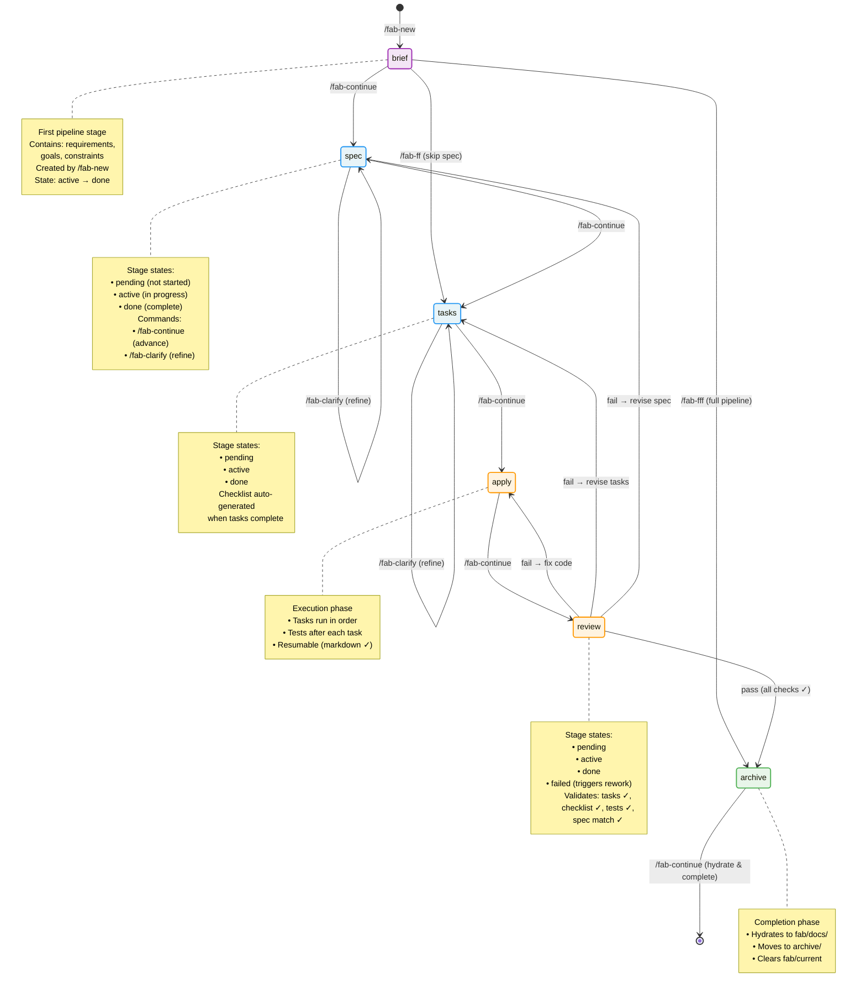

# User Flow Diagrams

> Visual maps of the Fab workflow — how commands connect and what each flow looks like in practice.

---

## 1. How Development Works Today

The stages every developer already follows — define what to build, design it, break it down, code it, review it, close it. Fab doesn't invent new stages; it gives each one a name and a place.

---

## 2. The Same Flow, With Fab

Each transition is now a `/fab-*` command. Shortcuts (`/fab-ff`, `/fab-fff`) let you skip ahead when the change is straightforward.

---

## 3. Full Command Map

All `/fab-*` commands and how they tie together. Solid arrows are the primary flow; dashed arrows are lateral/utility actions.

---

## 4. Change State Diagram (ROUGH - NOT FINAL)

The complete state machine showing how a change progresses through all stages. Each stage can be in one of four states: `pending`, `active`, `done`, or `failed` (review only). The diagram shows normal forward flow, shortcuts, rework paths, and the commands that cause each transition.

